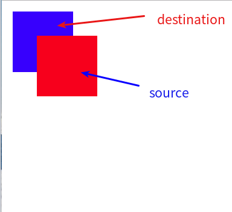
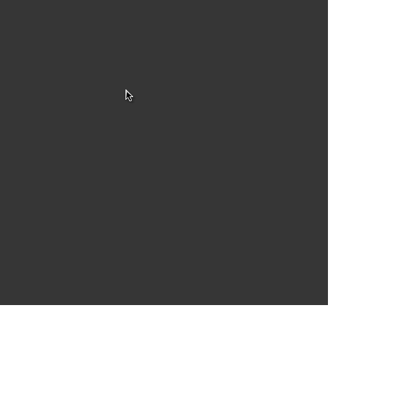
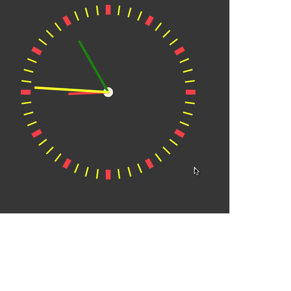
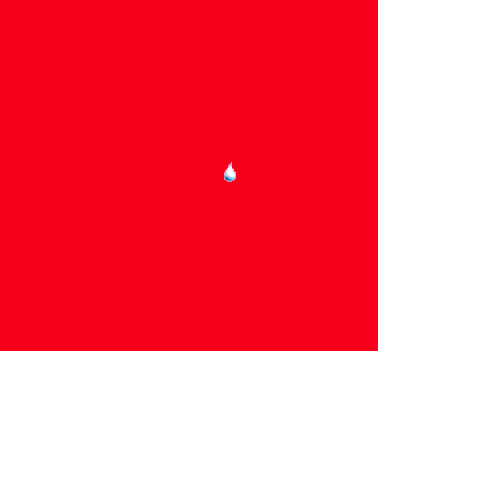

# Canvas 学习笔记

### 0. 参考文档

[菜鸟教程](https://www.runoob.com/w3cnote/html5-canvas-intro.html)

### 1. 兼容性以及获取上下文

```html
<script>
  var canvas = document.getElementById('plot');
  let ctx = null;
  canvas.getContext &&
    (() => {
      console.log(canvas.getContext('2d'));
      ctx = canvas.getContext('2d');
    })();
</script>
```

- 创建一个长宽固定的 canvas 标签
- 通过 id 选择器选择其标签
- 然后通过检测其 getContext 是否存在，来判断 canvas 标签是否支持 canvas 标签
- 这里得到的 ctx 对象即为我该 canvas 标签的上下文, 之后对其进行操作即可

### 2. 画一个矩形

```html
<canvas id="plot" width="300" height="300"></canvas>
<script>
  var canvas = document.getElementById('plot');
  canvas.getContext &&
    (() => {
      const ctx = canvas.getContext('2d');
      /* 先设置一个描边的样式stroke */
      ctx.strokeStyle = '#f44';
      ctx.lineWidth = 3;
      /*画出描边的图形*/
      ctx.strokeRect(10, 10, 55, 50);
      ctx.fillStyle = '#eee';
      ctx.fillRect(10, 10, 55, 50);
    })();
</script>
```

- 使用 canvas 画图形: 1.使用设置对应的画笔样式 2. 用对应的画笔样式画出图形
- stoke\*描边的图形
- fill\*实心的图形
- 这里的初始的坐标点是将绘制 canvas 画布的左上角作为原点的，向右和下分别为 x, y 的正坐标
- 这里画矩形的 strokeRect 参数为 矩形左上角点的的 x, y 离原点的距离以及长和宽

### 3. 路径的绘制

- 新建一条路径 (beginPath)
- 确定路径的起点 (moveTo(x, y))
- 调用绘制方法绘制路径(直线曲线) (arc, lineTo)
- 封闭路径 (closePath) -> 这一步如果需要画出闭合的图像可用，如果是一个非封闭图形，可以不用
- 用描边 stroke() 或者 填充 fill()方法来进行渲染

> Notes: 如果使用的是 fill 来进行渲染，那么一定是自动生成闭合图形后进行填充的

**通过 moveTo 来指定绘图的起始点，之后若是封闭路径，最后的结束点会和这个起始点连接**

#### 1. 直线绘制

```html
<canvas id="plot" width="300" height="300"></canvas>
<script>
  var canvas = document.getElementById('plot');
  canvas.getContext &&
    (() => {
      const context = canvas.getContext('2d');
      context.beginPath();
      context.moveTo(30, 30);
      context.lineTo(50, 40);
      context.lineTo(40, 50);
      // 非封闭图形
      // context.closePath();

      context.strokeStyle = '#f44';
      context.stroke();
    })();
</script>
```

#### 2. 弧形绘制

- arc(x, y, r, startAngle, endAngle, anticlockwise)
  - x: 圆心的 x 轴坐标
  - y: 圆心的 y 轴坐标
  - startAngle: 开始的弧形弧度 (角度 / 180 \* Math.PI)
  - endAngle: 结束的弧形弧度 (角度 / 180 \* Math.PI)
  - anticlosewise: 顺逆时针(true: 逆时针, false: 顺时针)

startAngle 为 0 的位置在以圆心为 x 轴的 x 轴上

```javascript
context.beginPath(0);
context.moveTo(100, 100);
context.arc(100, 100, 50, (Math.PI / 180) * 30, (Math.PI / 180) * 120, false);
context.closePath();
context.strokeStyle = '#f44';
context.stroke();
```

- arcTo(x1, y1, x2, y2, radius)
  - x1: 参考点的横坐标
  - y1: 参考点的纵坐标
  - x2: 结束点的横坐标
  - y2: 结束点的纵坐标
  - radius: 指定的半径

```javascript
context.beginPath();
context.moveTo(100, 100); // 初始点的坐标
context.arcTo(300, 100, 300, 300, 200);
context.closePath();
context.strokeStyle = '#f44';
context.stroke();
```


#### 3. 画贝塞尔曲线

- 二次贝塞尔曲线 quadraticCurveTo(cp1x, cp1y, x, y)
  - cp1x: 控制点 1 的横坐标
  * cp1y: 控制点 1 的纵坐标
  * x: 结束点 的横坐标
  - y: 结束点 的纵坐标

```javascript
const canvas = document.getElementById('bezier');
const context = canvas.getContext('2d');
context.beginPath();
context.moveTo(10, 200);
context.quadraticCurveTo(40, 100, 200, 200);
context.stroke();
```

- 三次贝塞尔曲线 bezierCurveTo(cp1x, cp1y, cp2x, cp2y, x, y)
  - cp1x: 控制点 1 的横坐标
  - cp1y: 控制点 1 的纵坐标
  - cp2x: 控制点 2 的横坐标
  - cp2y: 控制点 2 的纵坐标
  - x: 结束点的横坐标
  - y: 结束点的纵坐标

```javascript
context.beginPath();
context.moveTo(10, 50);
context.bezierCurveTo(20, 0, 60, 20, 100, 50);
context.strokeStyle = '#f44';
context.stroke();

context.beginPath();
context.moveTo(10, 50);
context.bezierCurveTo(20, 100, 60, 80, 100, 50);
context.strokeStyle = '#f44';
context.stroke();
```

### 4. 样式的修改

#### 1. 上色

1. fillStyle = color; 设置图形的填充颜色
2. strokeStyle = color; 设置图形轮廓的颜色
   **这里的 color 可以是 16 进制纯色例如: '#f44', 或者自带的颜色'red', 也可以是渐变色**
3. 渐变色设置

```javascript
var gradient = ctx.createLinearGradient(0, 0, 170, 150);
gradient.addColorStop('0', 'magenta');
gradient.addColorStop('0.3', 'blue');
gradient.addColorStop('0.6', 'red');
gradient.addColorStop('1.0', 'yellow');

ctx.strokeStyle = gradient;
ctx.lineWidth = 5;
ctx.strokeRect(20, 20, 150, 100);
```

- 通过 createLinearGradient 创建一个渐变对象，从左上角到右下角的
- addColorStop(present, color)
  - present: 颜色停止的百分比
  - color: 停止时的颜色

* 得到的 gradient 即是渐变的颜色

4. 色谱图的实现

```html
<canvas id="canvas" width="500" height="500"></canvas>
<script>
  const canvas = document.getElementById('canvas');
  const context = canvas.getContext('2d');

  context.lineWidth = 5;
  context.strokeStyle = '#333';
  context.strokeRect(100, 100, 300, 300);

  for (i = 0; i < 10; i++) {
    for (j = 0; j < 10; j++) {
      const x = 100 + (i * 300) / 10;
      const y = 100 + (j * 300) / 10;

      context.fillStyle = `rgba(${255 - (255 / 10) * i}, ${255 -
        (255 / 10) * j}, 255)`;
      context.fillRect(x, y, 300 / 10, 300 / 10);
    }
  }
</script>
```

#### 2. 线形变化

- 线宽(lineWidth)
  - ctx.lineWidth = 10; (设置线性的宽度)

* 线形(lineCap = 'butt' | 'round' | 'square')
  - butt: 末端以方形结束
  - round: 末端以圆形结束
  - square: 末端多出一个矩形区域

```javascript
const canvas = document.querySelector('#lineStyle');
const context = canvas.getContext('2d');

const capStyle = ['butt', 'round', 'square'];

capStyle.forEach((elem, i) => {
  context.beginPath();
  context.moveTo(100, 100 + i * 20);
  context.lineTo(300, 100 + i * 20);
  context.lineWidth = 10;
  context.lineCap = elem;
  const gradient = context.createLinearGradient(100, 0, 400, 0);
  gradient.addColorStop('0', '#ff4444');
  gradient.addColorStop('1', 'yellow');
  context.strokeStyle = gradient;
  context.stroke();
});
```

- 线线接合处线形 lineJoin = 'round' | 'bevel' | 'miter'
  - round: 额外的圆形
  - bevel: 连接处为一个平底
  - miter: 相接处为一个菱形区域

```javascript
const lineJoin = ['round', 'bevel', 'miter'];

lineJoin.map((elem, i) => {
  context.beginPath();
  context.moveTo(100 + i * 50, 400);
  context.lineTo(120 + i * 50, 300);
  context.lineTo(15 + i * 50, 400);
  context.strokeStyle = '#f44';
  context.lineWidth = 5;
  context.closePath();
  context.lineJoin = elem;
  context.stroke();
});
```

- 绘制虚线的方法

  - setLineDash(arr);
    - arr 用于设置虚线的样式，输入为[]时，则为实线,例如[5, 5]，表示虚线的实线和透明部分长度是 5 像素和 5 像素。

  * lineDashOffset
    - 设置的值为第一段实线的偏移量，左负右正

```javascript
context.moveTo(50, 50);
context.setLineDash([10, 10]);
context.lineDashOffset = -5;
context.strokeStyle = 'blue';
context.strokeRect(50, 50, 100, 100);

context.beginPath();
context.moveTo(100, 200);
context.lineTo(300, 200);
context.strokeStyle = 'purple';
context.setLineDash([10, 5, 20]);
context.lineDashOffset = -3;
context.stroke();
```

### 5. 绘制文本

#### 1. 文本绘制

- fillText(text, x, y)
- strokeText(text, x, y)
  - text: 显示文本
  - x: 文本起始点横坐标
  - y: 文本起始点纵坐标

#### 2. 文本样式

- font = 'fontSize fontFamily'
  - fontSize: 例如 18px
  - fontFamily: 'pingFangSC-Regular'

* textAlign = 'start' | 'end' | 'center' | 'left' | 'right'
  > 这里基准线为 fillText, strokeText 设置的 x, y 坐标
  - start 和 left: 文本的左边对其到基准线 x 的坐标
  * end 和 right: 文本的右边对准其基准线的 x 坐标
  * center: 文本的中间对准基准线的 x 坐标

- textBaseline = 'top' | 'hanging' | 'middle' | 'alphabetic' | 'ideographic' | 'bottom'
  - top: 文字的顶部与基准线的 y 坐标对其
  - bottom: 文字底部与基准线的 y 坐标对其
  - middle: 文字中部与基准线 y 坐标对其

* direction (chrome 不支持该属性就先不讨论了)

```javascript
const canvas = document.querySelector('.c1');
canvas.getContext &&
  (() => {
    const context = canvas.getContext('2d');
    context.font = '50px PingFangSC-Regular';
    context.textBaseline = 'middle';
    context.textAlign = 'center';
    context.direction = 'rtl';
    context.fillText('学习强国', 250, 50);
    context.strokeText('学习强国', 250, 110);
  })();
```

### 6. 绘制图片

- 创建图片对象 img
- 引入图片文件的源目录
- 画出图片(drawImage(image, x, y, width, height, dx, dy, dw, dh))

  - 情况１: 四参数：(x, y 代表图片在画布中的位置)

    - image: 图片对象
    - x: 距离原点的横坐标
    - y: 距离原点的纵坐标
    - width: 缩放的长度
    - height: 缩放的宽度

  - 情况２: 八参数:(x, y 代表图片在显示窗口中的位置)
    - image: 图片对象
    - x: 图片移动窗口的横坐标
    - y: 图片移动窗口的纵坐标
    - dx:　该图片左上角在画布中的横坐标
    - dy: 该图片左上角在画布中的纵坐标
    - dw: 切图后的图片长度
    * dh: 切图后的图片宽度

```javascript
const container = document.querySelector('#canvas');
const ctx = container.getContext('2d');
const imgD = document.querySelector('.img');

var img = new Image();
img.src = './1.jpeg';
img.onload = function() {
  ctx.drawImage(img, 10, 10, 50, 50);
};
```

### 7.状态的保存和恢复

> 状态的保存和恢复机制，是通过栈实现的，每次执行 save 就类似入栈，然后 restore 将上一次保存的状态出栈, save 和 restore 没有任何输入参数

- save
- restore

```javascript
const can = document.querySelector('#canvas');
const ctx = can.getContext('2d');
ctx.setLineDash([20, 5, 5, 10]);
ctx.lineDashOffset = -3;
ctx.strokeStyle = '#f44';
ctx.strokeRect(10, 10, 100, 50);

ctx.save();
ctx.setLineDash([]);
ctx.strokeStyle = '#333';
ctx.strokeRect(10, 100, 100, 50);

ctx.restore();
ctx.lineDashOffset = 5;
ctx.strokeRect(10, 180, 100, 50);
```

### 8. 变形

#### 1. 改变原点坐标(translate(x, y))

- x: 现在坐标系中的 x 坐标,之后该位置为新的坐标原点的 x 坐标
- y: 现在坐标系中的 y 坐标,之后该位置为新的坐标原点的 y 坐标

```javascript
const can = document.querySelector('#id');
const ctx = can.getContext('2d');
ctx.save();

ctx.translate(100, 100);
ctx.fillStyle = '#f44';
ctx.fillRect(0, 0, 100, 100);

ctx.restore();
ctx.fillRect(0, 0, 100, 100);
```

#### 2. 旋转坐标轴(rotate(angle))

- angle: 弧度为单位的转角, 正为顺时针的旋转角度

```javascript
const can = document.querySelector('#id');
const ctx = can.getContext('2d');

ctx.rotate((Math.PI / 180) * 60);
ctx.beginPath();
ctx.moveTo(0, 0);
ctx.lineTo(300, 0);
ctx.strokeStyle = '#f44';
ctx.stroke();

ctx.rotate((Math.PI / 180) * -15);
ctx.fillStyle = 'blue';
ctx.fillRect(0, 0, 100, 100);
```

#### 3. 尺寸变换 scale(x, y)

- x: x 方向上的缩放尺度，>1 放大; <1 缩小
- y: y 方向上的缩放尺度，>1 放大; <1 缩小

> 这里的 scale 变换后，包括 moveTo(x, y)中的 x, y 都是会进行倍数的放大缩小的

```javascript
// 将坐标轴初始化
ctx.restore();
ctx.translate(100, 300);
ctx.fillStyle = 'yellow';
ctx.fillRect(0, 0, 50, 50);

ctx.scale(2, 2);
ctx.fillStyle = 'orange';
ctx.fillRect(0, 25, 50, 50);
```

> 在原点变换后记得需要对变换前的进行保存

#### 4. 变换矩阵 transform (a, b, c, d, e, f)

**这里的水平垂直方向上的倾斜和 skew 是相反的**

- a: 水平方向上的放大缩小倍数

* b: 水平方向上的倾斜 ---- 类似于 skewY

- c: 垂直方向上的倾斜量 ---- 类似于 skewX

- d: 垂直方向上的放大缩小倍数

- e, f: 水平和垂直方向上的偏移量

```javascript
ctx.translate(100, -180);
ctx.transform(1, (Math.PI / 180) * 30, 0, 1, 0, 0);
ctx.fillStyle = '#333';
ctx.fillRect(0, 50, 50, 50);
```

[skew 原理详细分析](https://blog.csdn.net/qq_24724109/article/details/103172306)

### 9. 图形组合

- globalCompositeOperation = 'source-over' | 'source-in' | 'source-out' | 'source-atop' | 'destination-over' | 'destination-in' | 'destination-out' | 'destination-atop' | 'lighter' | 'darken' | 'lighten' | 'xor' | 'copy'

* source 　和　 destination

  - source: 新图像 作为目标图像
  - destination: 老图像 作为目标图像
  - 

* \*-(over | in | out | atop)

  - over: 目标图像遮盖老图像上
  - in: 目标图像和老图像上的重叠部分，且显示目标图像的样式
  - out:　目标图像没和老图像上重叠的部分
  - atop: 在老图像上显示与目标图像上重合的部分

* lighter
  - 重合的部分，颜色做加处理

- darken

  - 重叠部分保留最黒的部分
  - blue: #0000fff red: #ff0000
  - darken: #000000

- lighten

  - 重叠部分保留最亮的部分
  - blue: #0000ff red: #ff0000
  - lighten: #ff00ff

- xor
  - 重叠部分变透明

* 代码实例

```html
<canvas id="id" width="1000" height="1000"></canvas>
<script>
  const c = document.querySelector('#id');
  const ctx = c.getContext('2d');

  ctx.fillStyle = 'blue';
  ctx.fillRect(0, 0, 100, 100);

  ctx.globalCompositeOperation = 'darken';
  ctx.fillStyle = '#29a19c';
  ctx.fillRect(50, 50, 100, 100);

  ctx.globalCompositeOperation = 'lighter';
  ctx.fillStyle = '#26baee';
  ctx.fillRect(100, 100, 100, 100);

  ctx.globalCompositeOperation = 'xor';
  ctx.fillStyle = 'yellow';
  ctx.fillRect(150, 150, 100, 100);

  const sourcePick = ['source', 'destination'];
  const type = ['over', 'in', 'out', 'atop'];

  sourcePick.forEach((elem, i) => {
    type.forEach((x, j) => {
      setTimeout(() => {
        const type = `${elem}-${x}`;
        ctx.fillStyle = 'red';
        ctx.fillRect(0, 300, 50, 50);

        ctx.globalCompositeOperation = type;
        ctx.fillStyle = 'blue';
        ctx.fillRect(30, 330, 50, 50);
      }, (i + j) * 3000);
    });
  });
</script>
```

### 10. 裁剪路径

- clip()
  - 只显示路径内的区域，路径之外的区域被隐蔽
  - clip 只能遮罩调用 clip 之后的图形

```html
<canvas id="pic" width="500" , height="500"></canvas>
<script>
  const con = document.querySelector('#pic');
  const ctx = con.getContext('2d');

  ctx.beginPath();
  ctx.strokeStyle = '#f44';
  ctx.arc(100, 100, 50, (Math.PI / 180) * 90, (Math.PI / 180) * 360, false);
  ctx.clip();

  //　这里的矩形会被遮罩
  ctx.fillStyle = 'blue';
  ctx.fillRect(0, 0, 300, 300);
</script>
```

### 11. 控制动画

- 执行动画需要进行定时重绘
  - setInterval
  - setTimeout
  - requestAnimationFrame

* requestAnimationFrame 用法
  - 帧动画需要循环调用
  * 帧动画循环内需要设置结束条件
  - 帧动画的第一帧需要额外调用

```javascript
var process = 0;
var $box = document.querySelector('.box');

function render() {
  process += 1;
  $box.style.left = `${process}px`;
  console.log(process);
  if (process < 300) {
    window.requestAnimationFrame(render);
  }
}

window.requestAnimationFrame(render);
```

### 12. 案例一 自转公转模型

#### 1. 模型结果



#### 2. 实现思路

- 通过 requestAnimationFrame, 每次迭代之前需要清除整张图
- 需要对整张图进行重绘(初始化)
- 在画出中心的时候, 保存其坐标位置 ctx.save()
- 之后旋转坐标系(旋转角度动态变化即可), 旋转坐标系后, 更改坐标原点的坐标(移动原点到圆周上)

#### 3. 代码实现

```html
<canvas class="case" width="500" height="500"></canvas>
<script>
  let con = document.querySelector('.case');
  let ctx = con.getContext('2d');

  const update = () => {
    ctx.restore();
    ctx.clearRect(0, 0, 500, 500);
    ctx.save(); // 0 0
    ctx.fillStyle = '#333';
    ctx.fillRect(0, 0, 500, 500);

    ctx.translate(250, 250);
    ctx.beginPath();
    ctx.arc(0, 0, 200, 0, Math.PI * 2);
    ctx.strokeStyle = '#fff';
    ctx.stroke();

    ctx.beginPath();
    ctx.arc(0, 0, 60, 0, Math.PI * 2);
    ctx.fillStyle = '#eb8242';
    ctx.fill();

    ctx.rotate(
      ((Math.PI * 2) / 60) * new Date().getSeconds() +
        ((Math.PI * 2) / 60000) * new Date().getMilliseconds()
    );
    ctx.translate(0, -200);
    ctx.beginPath();
    ctx.fillStyle = '#26baee';
    ctx.arc(0, 0, 20, 0, Math.PI * 2);
    ctx.fill();

    ctx.beginPath();
    ctx.strokeStyle = 'rgba(255, 255, 255, 0.3)';
    ctx.arc(0, 0, 50, 0, Math.PI * 2);
    ctx.stroke();

    ctx.rotate(
      ((Math.PI * 2) / 6) * new Date().getSeconds() +
        ((Math.PI * 2) / 6000) * new Date().getMilliseconds()
    );
    ctx.translate(0, -50);

    ctx.beginPath();
    ctx.fillStyle = '#fcf5b0';
    ctx.arc(0, 0, 10, 0, Math.PI * 2);
    ctx.fill();

    requestAnimationFrame(update);
  };

  requestAnimationFrame(update);
</script>
```

### 13. 案例二 时钟

- 实现效果:



- 代码实现：

```javascript

<!DOCTYPE html>
<html lang="en">
  <head>
    <meta charset="UTF-8" />
    <meta name="viewport" content="width=device-width, initial-scale=1.0" />
    <meta http-equiv="X-UA-Compatible" content="ie=edge" />
    <title>案例2</title>
  </head>
  <body>
    <canvas id="id" width="500" height="500"></canvas>
    <script>
      const con = document.querySelector('#id');
      const ctx = con.getContext('2d');
      const radius = 180;
      const draw = () => {
        ctx.restore();
        ctx.save();
        ctx.clearRect(-250, -250, 500, 500);
        ctx.fillStyle = '#333';
        ctx.fillRect(0, 0, 500, 500);

        ctx.translate(250, 250);
        ctx.save(); //250 250
        ctx.beginPath();
        ctx.strokeStyle = '#fff';
        ctx.arc(0, 0, radius, 0, Math.PI * 2);
        ctx.strokeStyle = 5;
        ctx.strokeStyle = 'transparent';
        ctx.closePath();
        ctx.stroke();

        for (i = 0; i < 48; i++) {
          ctx.restore();
          ctx.save();
          const angle = ((Math.PI * 2) / 48) * i;
          ctx.beginPath();
          ctx.rotate(angle);
          ctx.translate(0, -radius);
          ctx.moveTo(0, 0);
          ctx.lineTo(0, 20);
          if (!(i % 4)) {
            ctx.strokeStyle = '#f44';
            ctx.lineWidth = 10;
          } else {
            ctx.strokeStyle = 'yellow';
            ctx.lineWidth = 3;
          }
          ctx.stroke();
        }

        const hour = new Date().getHours() % 12;
        const minutes = new Date().getMinutes();
        const seconds = new Date().getSeconds();
        const milseconds = new Date().getMilliseconds();

        ctx.restore();

        const s_angle =
          (Math.PI * 2 * seconds) / 60 + (Math.PI * 2 * milseconds) / 60000;
        const m_angle =
          (Math.PI * 2 * minutes) / 60 +
          (Math.PI * 2 * seconds) / 60 / (48 * 15);
        const h_angle =
          (Math.PI * 2 * hour) / 12 + (Math.PI * 2 * minutes) / 60 / 12;

        const plotPins = (angle, color, offsetY) => {
          ctx.save();
          ctx.rotate(angle);
          ctx.beginPath();
          ctx.moveTo(0, 0);
          ctx.lineWidth = 5;
          ctx.lineCap = 'round';
          ctx.strokeStyle = color;
          ctx.lineTo(0, -(radius - offsetY));
          ctx.stroke();
          ctx.restore();
        };

        plotPins(h_angle, '#f44', 100);
        plotPins(m_angle, 'green', 60);
        plotPins(s_angle, 'yellow', 30);

        ctx.beginPath();
        ctx.fillStyle = '#fff4e0';
        ctx.arc(0, 0, 10, 0, Math.PI * 2, false);
        ctx.fill();

        requestAnimationFrame(draw);
      };
      requestAnimationFrame(draw);
    </script>
  </body>
</html>


```

### 案例 3 渲染效果

- 实现效果:



- 代码实现:

```html
<canvas id="id" width="500" height="500"></canvas>
<script>
  const canvas = document.getElementById('id');
  const ctx = canvas.getContext('2d');
  canvas.style.background = 'red';

  let speed = 8;
  let width = 0;
  let flag = false;
  let colorList = ['#9fe8fa', '#272343', '#e13a9d', '#fa697c'];
  let index = 0;

  canvas.onclick = diffusion;

  function diffusion(e) {
    const { layerX, layerY } = e;
    ctx.globalCompositeOperation = 'source-over';

    function draw() {
      if (width >= 1000) {
        flag = true;
        index = Math.floor(Math.random() * colorList.length);
        width = 0;
        return;
      }
      width += speed;
      console.log(colorList[index]);
      ctx.fillStyle = colorList[index];
      ctx.fillRect(layerX - width / 2, layerY - width / 2, width, width);
      requestAnimationFrame(draw);
    }
    draw();
  }
</script>
```

### 案例 4 写字版效果

#### 实现效果


#### 代码实现

```html
<canvas id="id" width="500" height="500"></canvas>
<script>
  const canvas = document.getElementById('id');
  const ctx = canvas.getContext('2d');
  let isClick = false;
  let [lastX, lastY] = [0, 0];
  let flag = false;

  ctx.fillStyle = '#333';
  ctx.fillRect(0, 0, 500, 500);

  canvas.onmousedown = event => {
    flag = true;
    const { layerX, layerY } = event;
    ctx.beginPath();
    ctx.arc(layerX, layerY, 5, 0, Math.PI * 2);
    ctx.fillStyle = '#eee';
    ctx.fill();
  };

  canvas.onmouseup = event => (flag = false);

  canvas.onmousemove = event => {
    if (flag) {
      const { layerX, layerY } = event;
      ctx.beginPath();
      ctx.arc(layerX, layerY, 5, 0, Math.PI * 2);
      ctx.fillStyle = '#eee';
      ctx.fill();
    }
  };

  canvas.onmouseout = event => {
    flag = false;
  };
</script>
```
